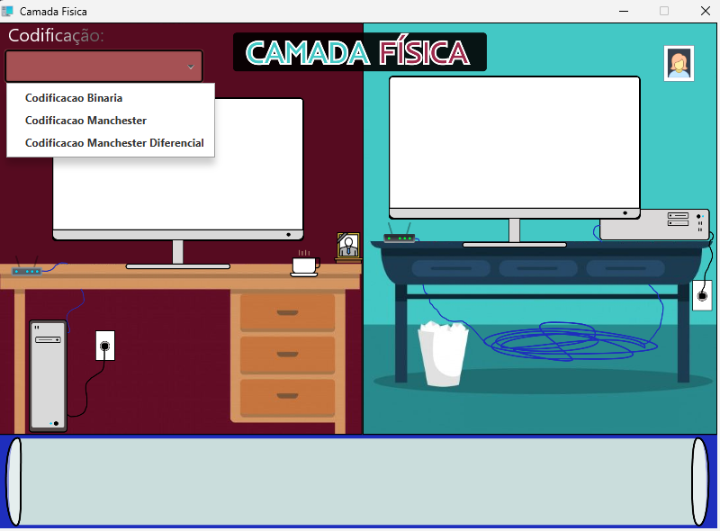
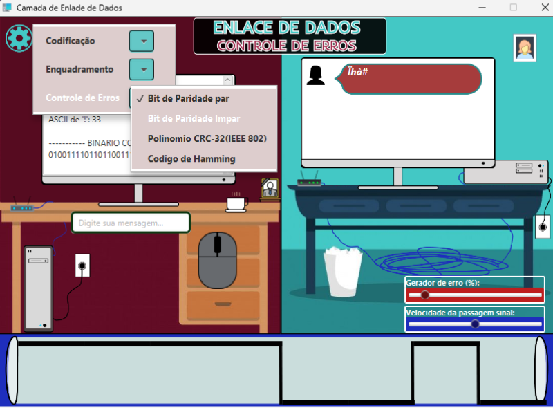
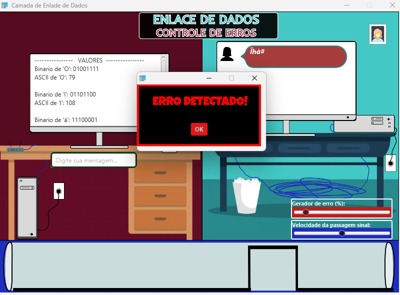
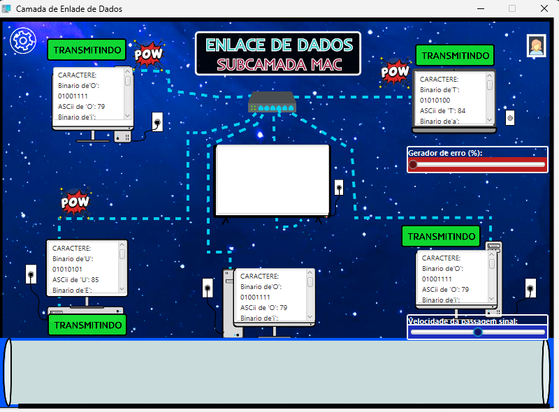
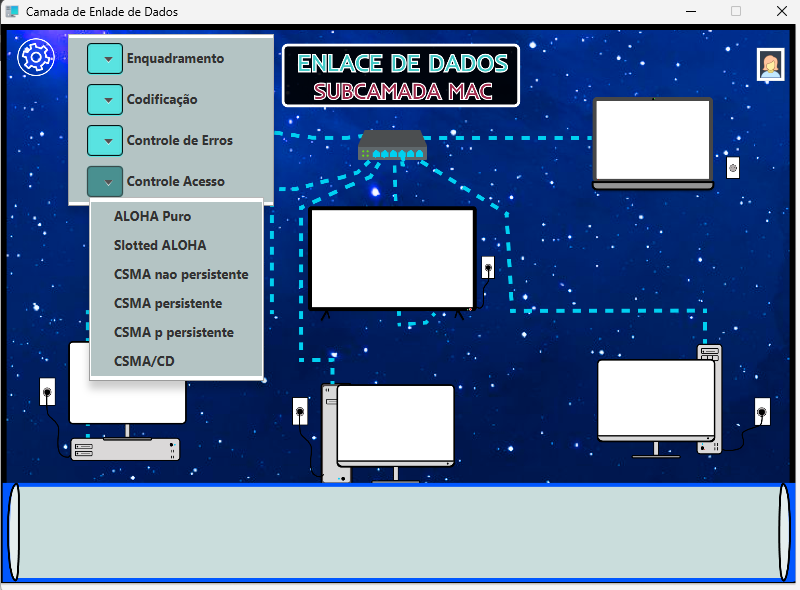

# Trabalhos da disciplina Redes de Computadores 1
Repositório com os projetos realizados para a disciplina de Redes de Computadores 1, na Universidade Estadual do Sudoeste da Bahia (UESB). Softwares de simulação do funcionamento das Camadas do Modelo OSI em uma Rede de Computadores

## Aplicação 💻🛜
Imagens da Aplicação
<table>
      Trabalho 1
  <tr>
    <td></td>
    <td></td>
  </tr>
    Trabalho 3
  <tr>
    <td></td>
    <td></td>
  </tr>
  Trabalho 5
  <tr>
    <td></td>
    <td></td>
  </tr>
</table>

## Autor
- https://github.com/Luan-Pinheiro

## 🚀 Sobre mim
Estudante de Ciência da Computação na Universidade Estadual do Sudoeste da Bahia (UESB).
